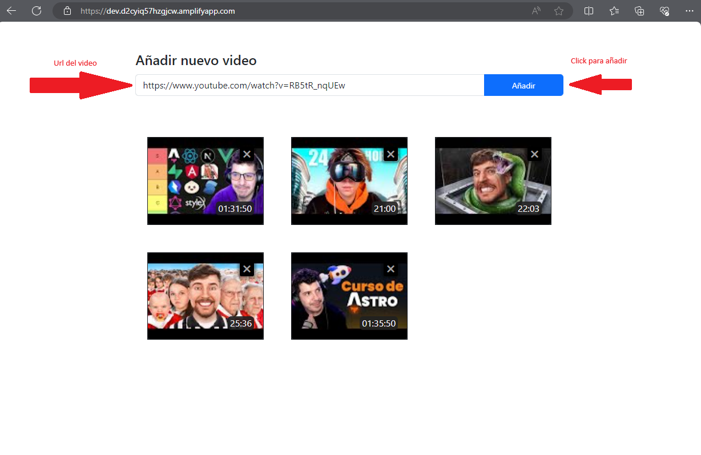
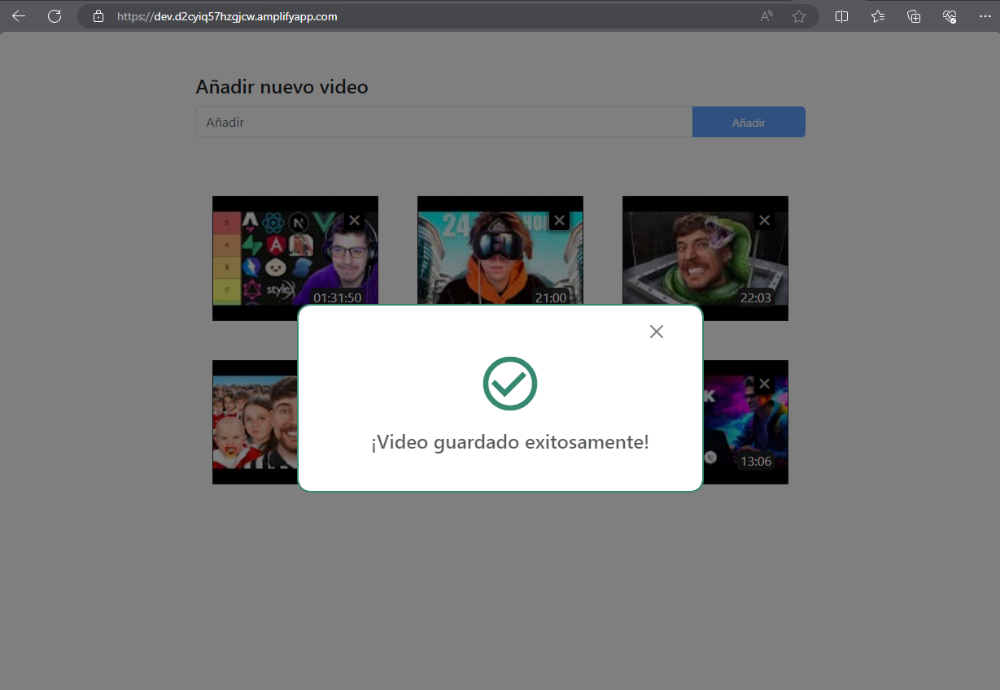
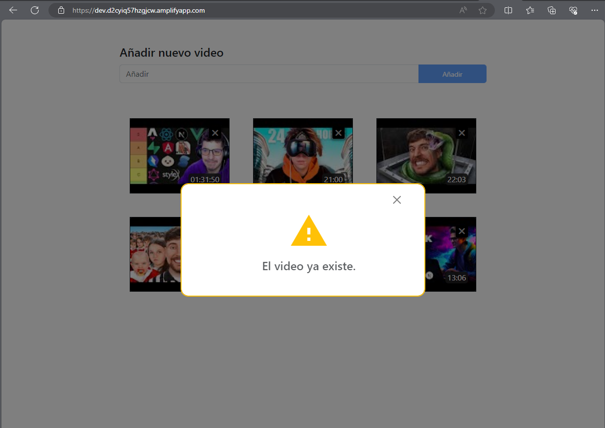
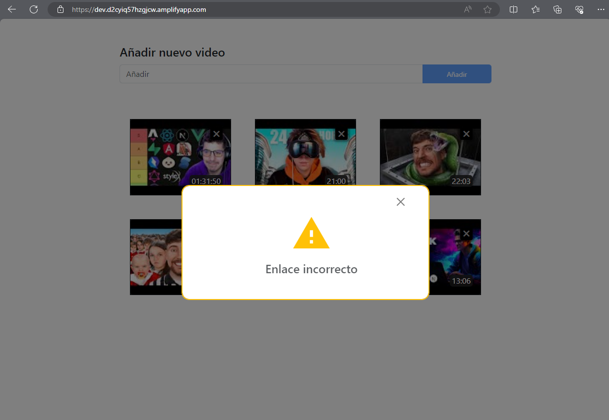
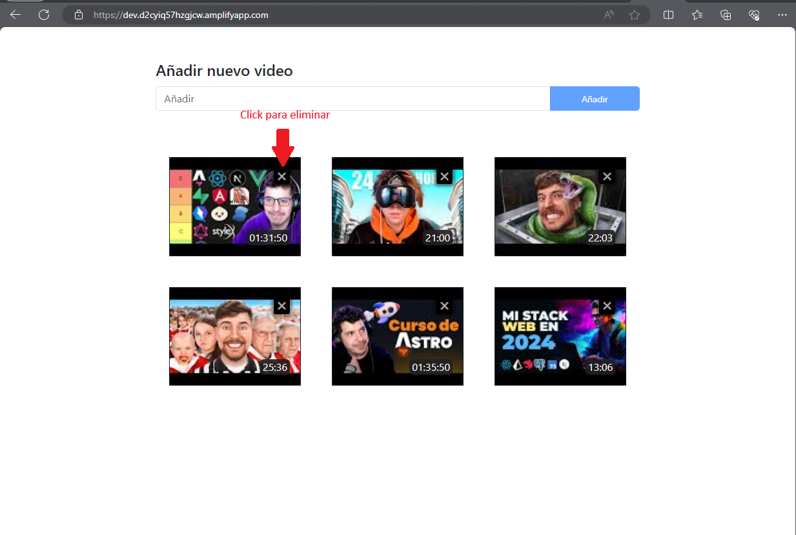
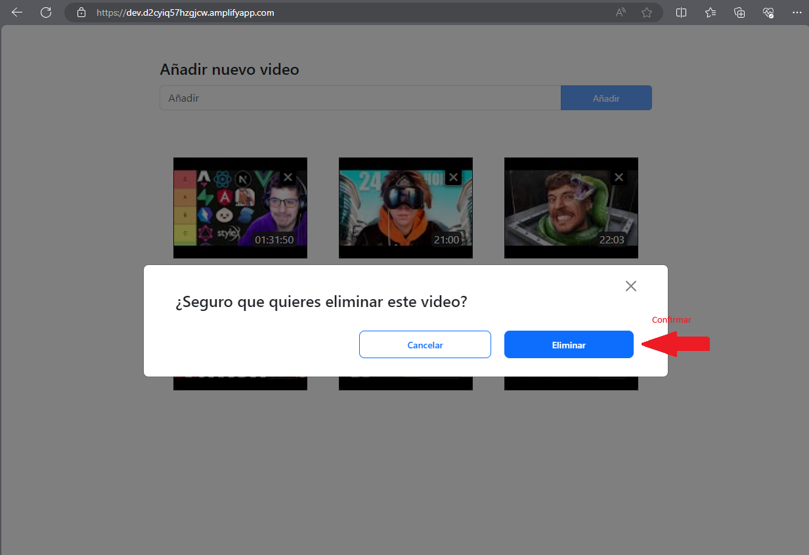
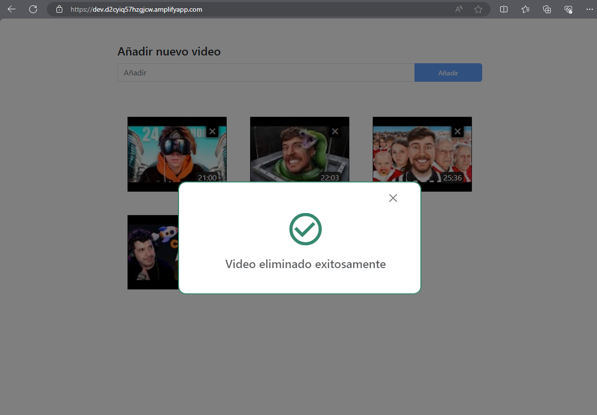
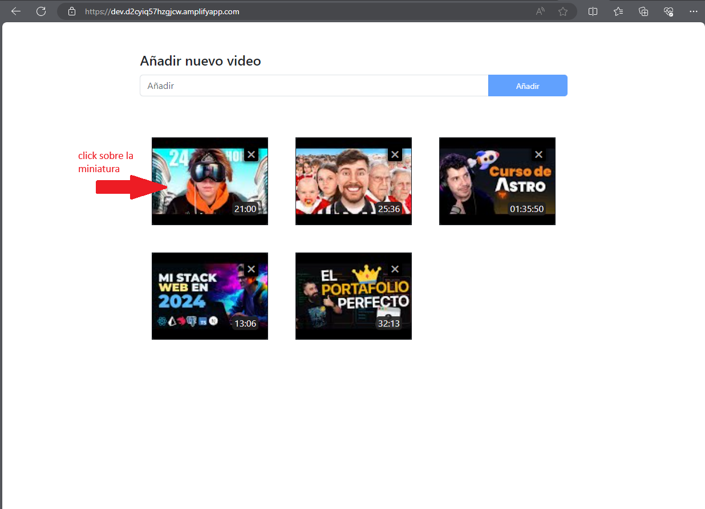
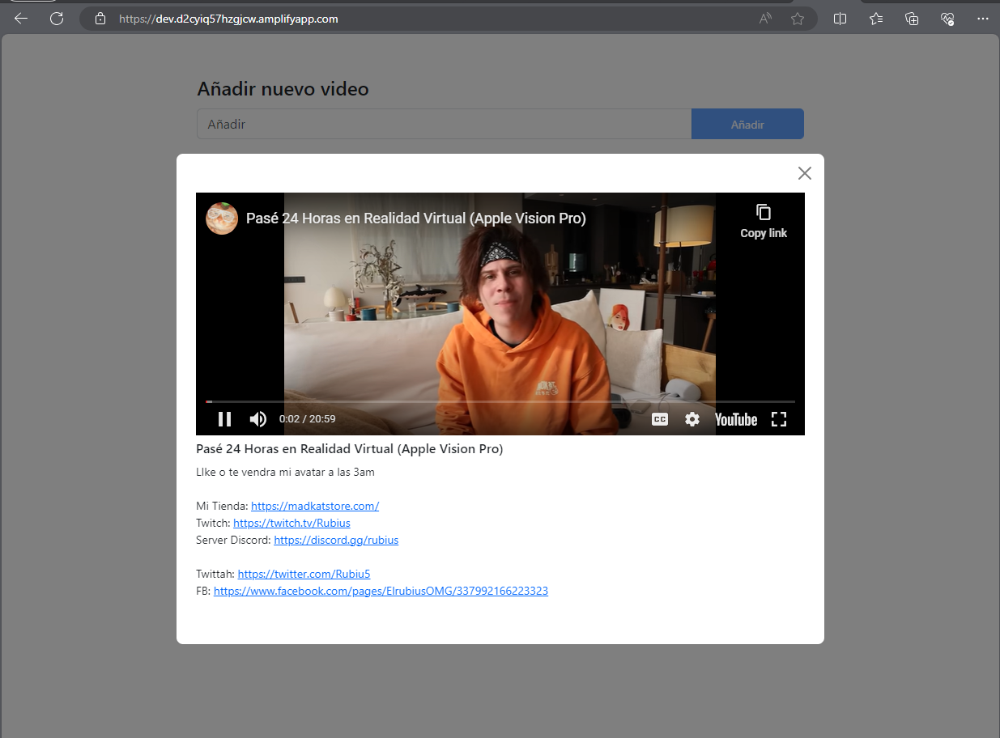

# Álbum Online de Videos de YouTube 📹

Este proyecto es un álbum online que permite a los usuarios pegar enlaces de videos de YouTube para visualizar todos los que han sido guardados. Los usuarios pueden ver miniaturas e información sobre los videos, reproducirlos directamente desde la interfaz y eliminarlos si así lo desean.

***

## Características 🚀

- Creación y visualización de un álbum de videos de YouTube.
- Interfaz para pegar enlaces de nuevos videos de YouTube.
- Visualización de miniaturas e información relevante de cada video.
- Reproducción de videos dentro de un modal.
- Opción para eliminar videos del álbum.

***

## Tecnologías Utilizadas 💻

- **Frontend**: Vue 3 con Composition API (`<script setup>`).
- **Backend**: NestJs (Node.js), desplegado en la nube en un Lambda/Serverless de AWS.
- **Base de Datos**: MySQL desplegado en AWS RDS.
- **API Data Youtube**: Uso de la API de YouTube para obtener información de los videos.
- **Hosting**: Amplify de AWS.

***

## Instrucciones de Uso 📝

**1.** Para agregar un nuevo video al álbum, simplemente pega el enlace del video de YouTube en el campo proporcionado y presiona el botón de añadir.

**2.** Navega por el álbum para ver todos los videos agregados, junto con su miniatura e información relevante.

**3.** Haz clic en cualquier video para abrir un modal con más detalles y opciones de reproducción.

**4.** Para eliminar un video, utiliza la opción correspondiente en la interfaz de usuario en el botón de eliminar ubicado en la esquina superior derecha de cada miniatura.

***

## Demo en Línea 🌐

Puedes ver una demostración en línea del proyecto [aquí](https://dev.d2cyiq57hzgjcw.amplifyapp.com/).

***

## Capturas de Pantalla 📷

### 1. Añadir video

##### [Añadir url]


##### [Video Guardado]


##### [Video repetido o existente en el album]


##### [Enlace o Url inválido]


##### [Error al guardar video]


***

### 2. Eliminar video

##### [Eliminar video]


##### [Confrimar eliminación]


##### [Video eliminado]


***

### 3. Ver detalle

##### [Apertura de modal Video]


##### [Modal con detalles (titulo, descripción, duración y minuatura)]


***

### 4. Reproducir video

##### [Click sobre la minuatura]


##### [Video reproduciendose]


***

## Estructura

#### Album - Frontend (Vue.js 3 - TypeScript)
```
album/
┣ public/
┃ ┗ favicon.ico
┣ src/
┃ ┣ assets/
┃ ┃ ┣ base.css
┃ ┃ ┣ bootstrap-personalized.css
┃ ┃ ┣ logo.svg
┃ ┃ ┗ main.css
┃ ┣ components/
┃ ┃ ┣ DeleteModal.vue
┃ ┃ ┣ NotificationsModal.vue
┃ ┃ ┗ VideoModal.vue
┃ ┣ stores/
┃ ┃ ┣ backendApi.ts
┃ ┃ ┣ notify.ts
┃ ┃ ┣ store.ts
┃ ┃ ┗ youtubeApi.ts
┃ ┣ amplifyconfiguration.json
┃ ┣ App.vue
┃ ┣ aws-exports.js
┃ ┗ main.ts
┣ .env-example
┣ .gitignore
┣ env.d.ts
┣ index.html
┣ package-lock.json
┣ package.json
┣ README.md
┣ tsconfig.app.json
┣ tsconfig.json
┣ tsconfig.node.json
┗ vite.config.ts
```

#### API-Album - Backend (NestJs - Node.js)
```
api-album/
┣ src/
┃ ┣ dto/
┃ ┃ ┣ findall-videos.dto.ts
┃ ┃ ┗ video.dto.ts
┃ ┣ entities/
┃ ┃ ┗ videos.entity.ts
┃ ┣ app.controller.ts
┃ ┣ app.module.ts
┃ ┣ app.service.ts
┃ ┣ lambda.ts
┃ ┗ main.ts
┣ test/
┃ ┣ app.e2e-spec.ts
┃ ┗ jest-e2e.json
┣ .env-example
┣ .eslintrc.js
┣ .gitignore
┣ .gitignore_respaldo
┣ .prettierrc
┣ handler.js
┣ nest-cli.json
┣ package-lock.json
┣ package.json
┣ README.md
┣ serverless.yml
┣ tsconfig.build.json
┗ tsconfig.json
```

***

## Contacto 📧

Si tienes alguna pregunta o comentario, no dudes en enviar un correo a jhojaforce@gmail.com.

